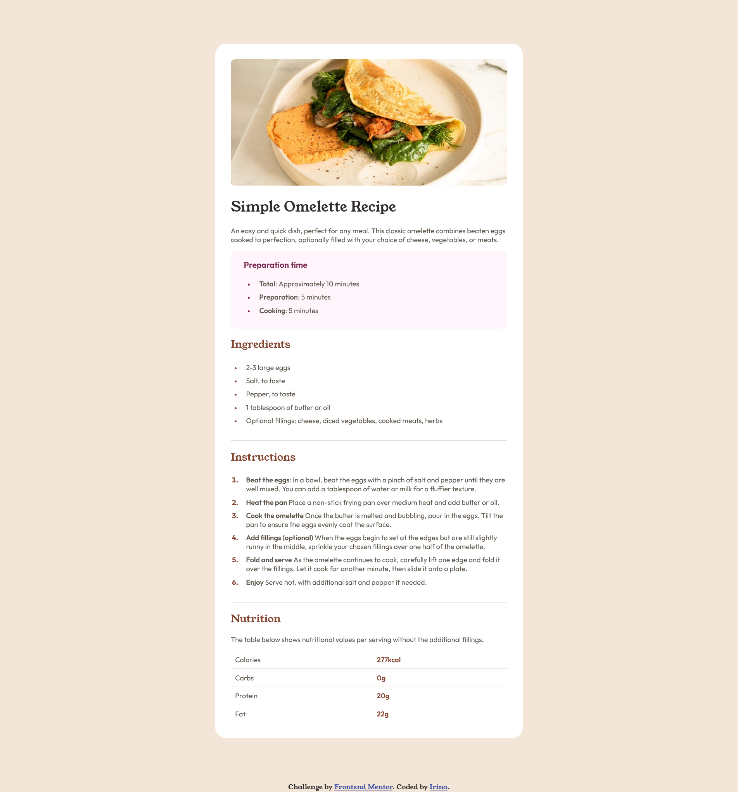

# Frontend Mentor - Recipe page solution

This is a solution to the [Recipe page challenge on Frontend Mentor](https://www.frontendmentor.io/challenges/recipe-page-KiTsR8QQKm). Frontend Mentor challenges help you improve your coding skills by building realistic projects. 

## Table of contents

- [Overview](#overview)
  - [The challenge](#the-challenge)
  - [Screenshot](#screenshot)
  - [Links](#links)
- [My process](#my-process)
  - [Built with](#built-with)
  

**Note: Delete this note and update the table of contents based on what sections you keep.**

## Overview

### The challenge
To build out a recipe page and get it looking as close to the desing as possible.

### Screenshot

### Links

- Solution URL: [Add solution URL here](https://iridiffinis.github.io/recipe-page-main/)

## My process

### Built with

- Semantic HTML5 markup
- CSS custom properties

